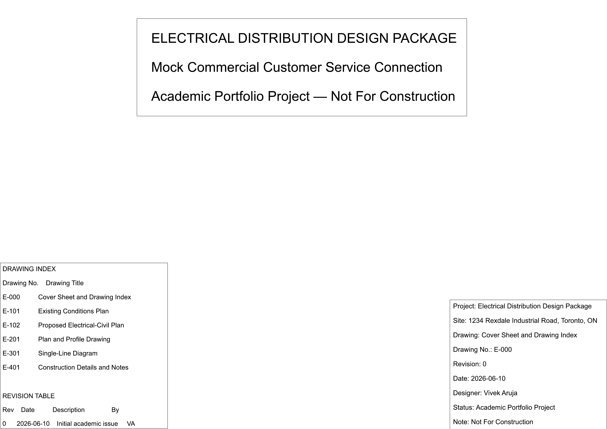
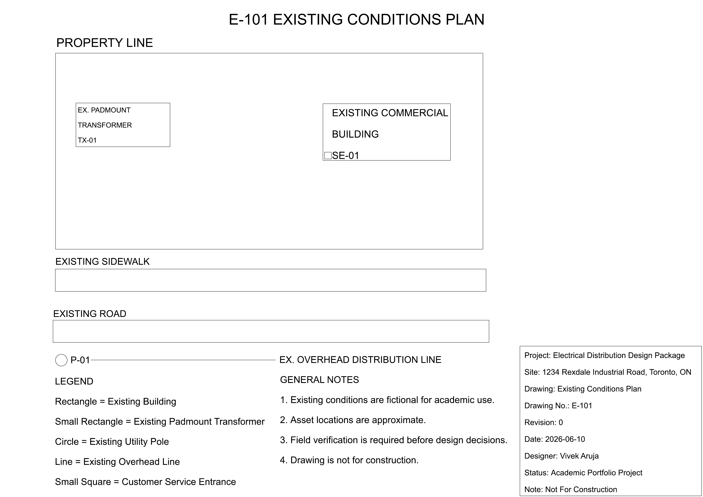
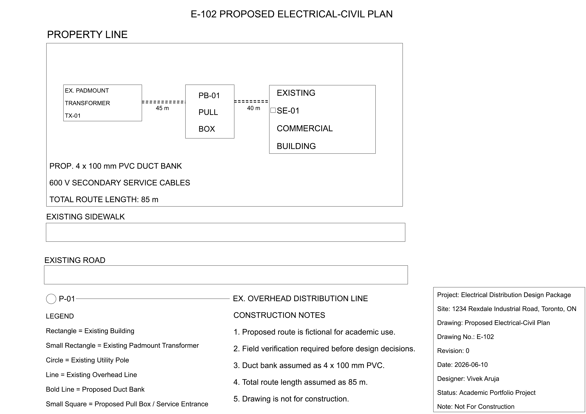
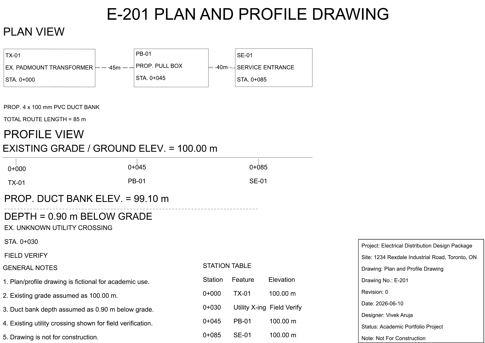
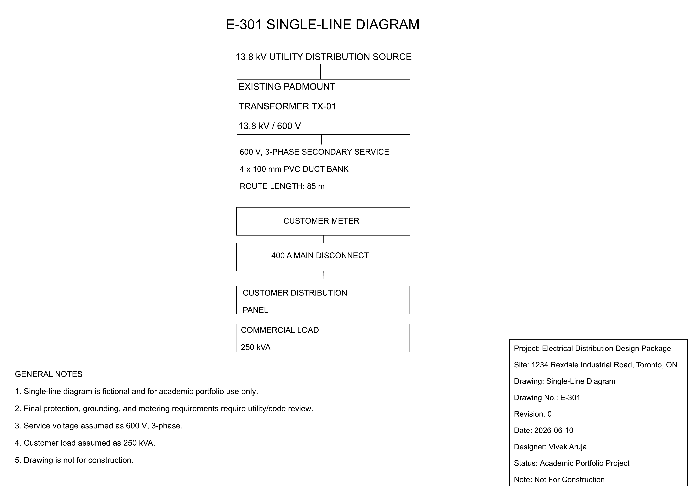
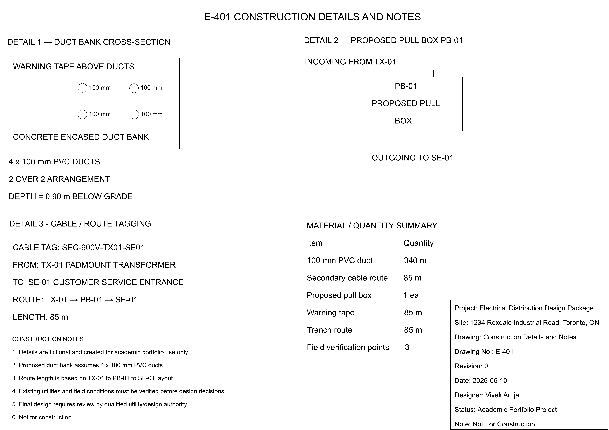
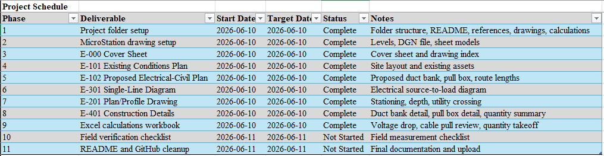
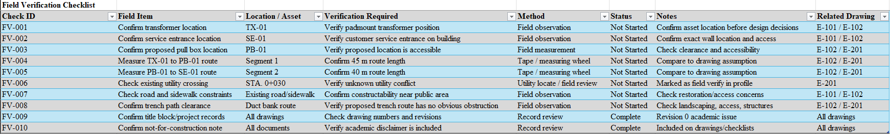

# MicroStation Distribution Service Connection Design Package

A mock utility-style electrical distribution design package for a fictional commercial customer service connection in Toronto. The project simulates a complete service connection workflow: route design, MicroStation drawing production, voltage drop and cable pull calculations, quantity takeoff, project record tracking, and field verification planning.

## Project Overview

Built around Bentley MicroStation and Microsoft Excel, the package documents a fictional 600 V, 3-phase underground secondary service connection from an existing padmount transformer to a customer service entrance, including drawing production, calculation review, project record management, and technical reporting.

System workflow:

```text
Project scenario defined → Existing conditions drawn → Proposed route designed → Plan/profile and single-line drawings created → Construction details documented → Voltage drop and quantity calculations performed → Project records tracked → Field verification checklist prepared → Final report compiled
```

## Key Features

- Fictional 600 V, 3-phase commercial service connection scenario
- Six-sheet MicroStation drawing package (cover sheet, existing conditions, proposed route, plan/profile, single-line diagram, construction details)
- Underground duct bank routing with stationing and depth callouts
- Simplified voltage drop calculation workbook
- Cable pull review across a pull-box-split route
- Quantity takeoff for duct, cable, and trench materials
- Project record tracker for drawing status and revisions
- Field verification checklist for unconfirmed site conditions
- Final LaTeX-compiled technical report

## Project Scenario

A fictional commercial warehouse requires a new 600 V, 3-phase underground secondary service connection from an existing padmount transformer (TX-01) to a customer service entrance (SE-01). The proposed route consists of an 85 m underground duct bank split at one pull box (PB-01), with 4 × 100 mm PVC ducts, supporting an assumed 250 kVA load.

| Item | Value |
|---|---|
| Existing transformer | TX-01 |
| Proposed pull box | PB-01 |
| Customer service entrance | SE-01 |
| Route segment 1 | TX-01 to PB-01, 45 m |
| Route segment 2 | PB-01 to SE-01, 40 m |
| Total route length | 85 m |
| Proposed duct bank | 4 × 100 mm PVC ducts |
| Assumed service voltage | 600 V, 3-phase |
| Assumed customer load | 250 kVA |

## Why This Project Was Built

This project was created to strengthen practical skills relevant to utility Design & Construction roles, including:

- CAD drafting using Bentley MicroStation
- Electrical and civil drawing documentation
- Underground distribution design concepts
- Voltage drop calculations
- Cable pull review
- Quantity takeoffs
- Project record tracking
- Field verification planning
- Technical report preparation

## Tools Used

| Tool | Function |
|---|---|
| Bentley MicroStation | Drawing production (DGN, PDF export) |
| Microsoft Excel | Voltage drop, cable pull, and quantity takeoff calculations |
| Microsoft Excel | Project record tracking and field verification checklist |
| LaTeX | Final technical report compilation |

## Drawing Package

| Drawing No. | Drawing Title | Purpose |
|---|---|---|
| E-000 | Cover Sheet and Drawing Index | Introduces the drawing package and drawing list |
| E-101 | Existing Conditions Plan | Shows existing road, sidewalk, property, transformer, building, pole, and overhead line |
| E-102 | Proposed Electrical-Civil Plan | Shows proposed duct bank route from TX-01 to PB-01 to SE-01 |
| E-201 | Plan and Profile Drawing | Shows stationing, route length, duct depth, and field verification point |
| E-301 | Single-Line Diagram | Shows electrical source-to-load relationship |
| E-401 | Construction Details and Notes | Shows duct bank detail, pull box detail, tagging, and quantity summary |

### E-000 Cover Sheet



[Download full-resolution PDF](drawings/exported-pdf/E-000-cover-sheet.pdf)

### E-101 Existing Conditions Plan



[Download full-resolution PDF](drawings/exported-pdf/E-101-existing-conditions-plan.pdf)

### E-102 Proposed Electrical-Civil Plan



[Download full-resolution PDF](drawings/exported-pdf/E-102-proposed-electrical-civil-plan.pdf)

### E-201 Plan and Profile Drawing



[Download full-resolution PDF](drawings/exported-pdf/E-201-plan-profile-drawing.pdf)

### E-301 Single-Line Diagram



[Download full-resolution PDF](drawings/exported-pdf/E-301-single-line-diagram.pdf)

### E-401 Construction Details and Notes



[Download full-resolution PDF](drawings/exported-pdf/E-401-construction-details-notes.pdf)

## Calculations

### Voltage Drop Calculation

Located in:

```text
calculations/voltage-drop-cable-pull-workbook.xlsx
```

Calculates line current from the assumed 250 kVA load and 600 V service voltage, then estimates voltage drop across the 85 m route using an assumed conductor resistance.

| Parameter | Value | Unit |
|---|---|---|
| Load | 250 | kVA |
| Voltage | 600 | V |
| Calculated current | 240.56 | A |
| Route length | 85 | m |
| Assumed conductor resistance | 0.000217 | ohm/m |
| Voltage drop | 7.69 | V |
| Voltage drop percent | 1.28 | % |

### Cable Pull Review

Reviews the route as split into two pull segments by PB-01 (45 m and 40 m), demonstrating the concept of breaking long secondary runs into shorter pulls rather than performing a full tension/sidewall pressure calculation.

### Quantity Takeoff

| Item | Quantity | Basis |
|---|---|---|
| 100 mm PVC duct | 340 m | 4 ducts × 85 m |
| Secondary cable route | 85 m | TX-01 to SE-01 |
| Proposed pull box | 1 ea | PB-01 |
| Warning tape | 85 m | Along trench route |
| Trench route | 85 m | Total route length |
| Field verification points | 3 ea | TX-01, PB-01, SE-01 |

## Project Records and Field Verification

### Project Record Tracker

Located in:

```text
project-records/project-record-tracker.xlsx
```

Tracks drawing numbers, drawing titles, revisions, PDF export status, and notes.



### Field Verification Checklist

Located in:

```text
field-verification/field-verification-checklist.xlsx
```

Identifies items requiring confirmation before design or construction decisions, including transformer location, service entrance location, pull box location, route measurements, existing utility conflicts, and road/sidewalk constraints.



## Problems Encountered

Several documentation and design-consistency issues came up during development:

- Keeping stationing, route length, and depth consistent across the plan/profile drawing and the Excel calculations
- Representing an unverified utility crossing without overstating its certainty on the drawing
- Splitting the route at a single pull box while keeping both segments within a reasonable pull length
- Aligning drawing numbering and revision status between the drawing set and the project record tracker

These were resolved through cross-checking drawing dimensions against the calculation workbook, iterative drawing revisions, and consistent use of the project record tracker.

## Limitations

This project uses simplified assumptions for academic and portfolio purposes. The drawings are not based on real utility records, internal design standards, confidential project information, or actual customer data. The voltage drop calculation uses a generic assumed conductor resistance rather than a manufacturer cable datasheet. Cable pulling tension, protection coordination, grounding, metering, and civil restoration were not modelled in detail. This project is not for construction.

## Future Improvements

- Detailed conduit fill and cable ampacity check
- Full cable pulling tension and sidewall pressure calculation
- Expanded project record tracker (multi-drawing, multi-revision)
- Mock site visit report linked to the field verification checklist
- Additional drawing sheets (grounding plan, metering detail)

## Folder Structure

```text
microstation-distribution-design-package/
│
├── README.md
│
├── calculations/
│   └── voltage-drop-cable-pull-workbook.xlsx
│
├── drawings/
│   ├── dgn/
│   │   └── distribution_service_connection_design.dgn
│   │
│   └── exported-pdf/
│       ├── E-000-cover-sheet.pdf
│       ├── E-101-existing-conditions-plan.pdf
│       ├── E-102-proposed-electrical-civil-plan.pdf
│       ├── E-201-plan-profile-drawing.pdf
│       ├── E-301-single-line-diagram.pdf
│       └── E-401-construction-details-notes.pdf
│
├── field-verification/
│   └── field-verification-checklist.xlsx
│
├── project-records/
│   └── project-record-tracker.xlsx
│
├── references/
│   ├── project-scenario.md
│   └── public-reference-notes.md
│
└── report/
    ├── microstation_distribution_design_package_report.pdf
    └── figures/
        ├── E-000-cover-sheet.png
        ├── E-101-existing-conditions-plan.png
        ├── E-102-proposed-electrical-civil-plan.png
        ├── E-201-plan-profile-drawing.png
        ├── E-301-single-line-diagram.png
        ├── E-401-construction-details-notes.png
        ├── project-record-tracker.png
        └── field-verification-checklist.png
```

## Final Report

The complete technical report for this project is included in:

```text
report/microstation_distribution_design_package_report.pdf
```

## Skills Demonstrated

- Utility drawing package development
- MicroStation drafting
- Existing conditions documentation
- Underground service routing
- Plan and profile development
- Single-line diagram creation
- Construction detail preparation
- Voltage drop analysis
- Cable pull review
- Quantity takeoffs
- Project record management
- Field verification planning
- Technical report writing

## Disclaimer

This project is a fictional engineering portfolio project created for educational purposes only. It is not based on any confidential utility information, customer data, or internal design standards. All drawings, calculations, and documentation are intended solely to demonstrate engineering documentation and utility design workflows.